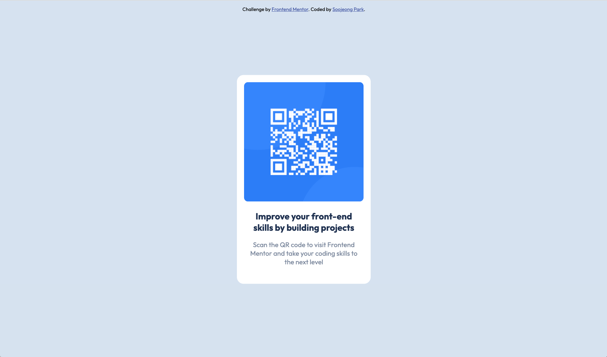

# Frontend Mentor - QR code component solution

This is a solution to the [QR code component challenge on Frontend Mentor](https://www.frontendmentor.io/challenges/qr-code-component-iux_sIO_H).

## Table of contents

- [Overview](#overview)
  - [Screenshot](#screenshot)
  - [Links](#links)
- [My process](#my-process)
  - [Built with](#built-with)
  - [What I learned + Continued development](#what-i-learned+continued-development)
- [Author](#author)

## Overview

### Screenshot

### Links

- Solution URL: [Add solution URL here](https://your-solution-url.com)
- Live Site URL: [Add live site URL here](https://your-live-site-url.com)

## My process

### Built with

- Semantic HTML5 markup
- CSS custom properties
- Flexbox
- Desktop-first workflow

### What I learned + Continued development

I used flexbox to center the qrcode-card vertically and horizontally. In the process of doing this, I learned that it's useful to set **html {width: 100%}** and **body {min-width: 100%}** when making sure that the body takes up the whole browser screen.

## Author

- Frontend Mentor - [@kongguksu](https://www.frontendmentor.io/profile/kongguksu)
